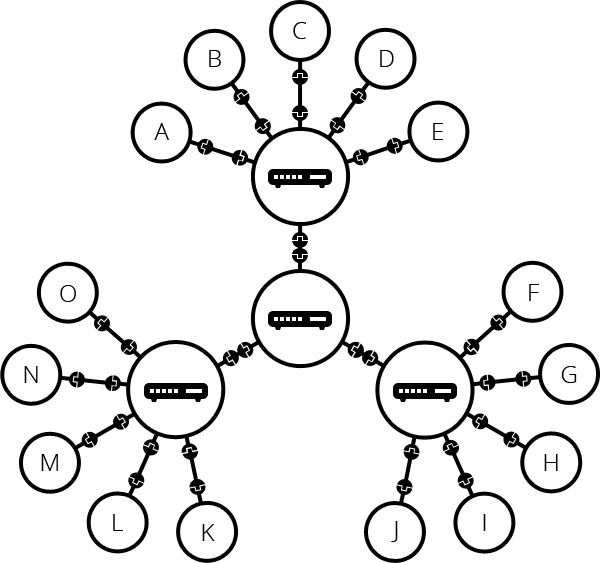
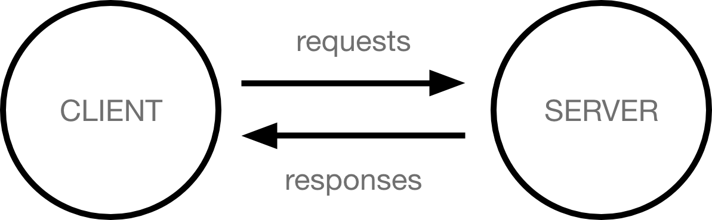
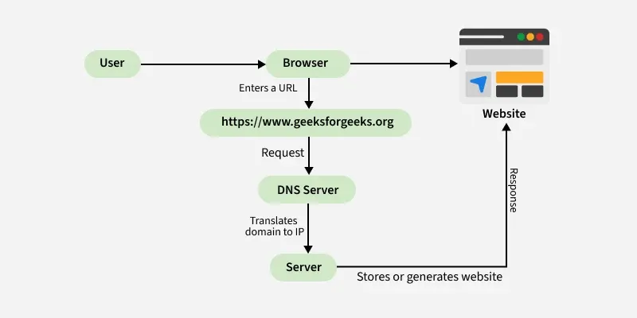
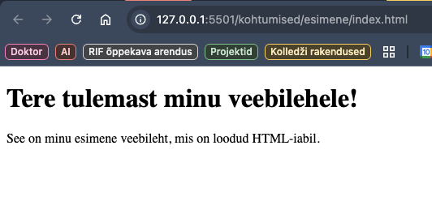
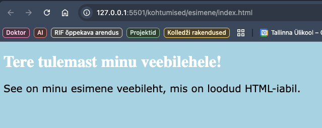
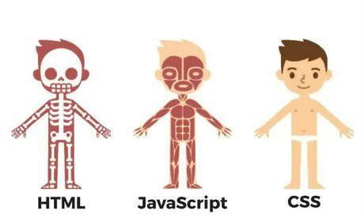
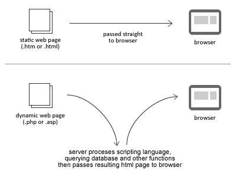

# Veebirakenduste loomine Wordpressi platvormil

Laura Hein, Martti Raavel

---

## Esimene kohtumine

- [Mis on internet?](../teemad/Internet/about.md)
- [Mis on veebileht?](../teemad/Veebileht/about.md)
- [Mis on Wordpress?](../teemad/Wordpress/about.md)
- [Wordpressi kasutamise eelised ja miinused](../teemad/plussidMiinused/about.md)
- [Wordpress.com vs Wordpress.org](../teemad/WordpressVSWordpress/about.md)
- [Wordpressi majutamine](../teemad/WordpressiMajutamine/about.md)

---

## Mis on internet?

---

## Mis on internet?

Arvutivõrkude võrkude võrk

- Arvutivõrgud
- Serverid ja kliendid
- Domeeninimed ja IP aadressid, DNS
- Protokollid
- ISP
- Ruuterid

---

## Võrkude võrk



[Allikas](https://developer.mozilla.org/en-US/docs/Learn_web_development/Howto/Web_mechanics/How_does_the_Internet_work)

---

## Kliendid ja serverid



---

## Kuidas arvuti teab, kus veebileht asub?

---

## Kuidas arvuti teab, kus veebileht asub?

- Iga veebileht on hostitud serveris, millel on unikaalne IP-aadress.
- Domeeninimed (nagu www.tlu.ee) on kasutajasõbralikud aadressid, mis suunavad kasutajad õigesse serverisse.
- DNS (Domain Name System) on süsteem, mis tõlgib domeeninimed IP-aadressideks, võimaldades veebilehitsejatel leida ja ühenduda õige serveriga, kus veebileht asub.

---

## Domain Name System (DNS)


[Allikas](https://developer.mozilla.org/en-US/docs/Learn_web_development/Howto/Web_mechanics/How_does_the_Internet_work)

---

## Mis siis tegelikult toimub?

1. Veebilehitseja pöördub DNS-serveri poole ja leiab sealt selle serveri tegeliku aadressi, kus veebileht asub.

2. Veebilehitseja saadab serverile HTTP-päringu, paludes saata veebilehe koopia kliendile. See sõnum ja kõik muud kliendi ning serveri vahel vahetatavad andmed edastatakse teie internetiühenduse kaudu, kasutades TCP/IP protokolli.

3. Kui server kliendi päringu heaks kiidab, saadab see kliendile vastuse "200 OK", mis tähendab: "Loomulikult võid sa seda veebilehte vaadata! Siin see on". Seejärel hakkab server veebilehe faile veebilehitsejale saatma väikeste osade kaupa, mida nimetatakse pakettideks.

4. Veebilehitseja paneb need väikesed osad kokku terviklikuks veebileheks ja kuvab seda teile.

---

## Veebilehe laadimine



[Allikas](https://www.geeksforgeeks.org/computer-networks/web-pages/)

---

## Mis on veebileht?

---

## Mis on veebileht?

Veebileht on kogum faile, mis on üldjuhul kättesaadavad internetis ühe konkreetse aadressi (näiteks *www.tlu.ee*) alt. Need failid võivad sisaldada **teksti**, **pilte**, **videoid**, **helifaile** ja muud meediat, samuti **koodi**, mis määrab, kuidas need elemendid kasutajale esitatakse. Veebilehti näidatakse kasutajale veebilehitseja abil, mis tõlgendab veebilehe koodi ja kuvab selle sisu kasutajaliideses.

---

## Milliseid tehnoloogiaid veebilehed kasutavad?

---

## HTML

HTML (HyperText Markup Language) on märgendikeel, mida kasutatakse veebilehe ja selle sisu struktureerimiseks.

HTML-i abil saab määratleda, millised osad veebilehel on pealkirjad, lõigud, pildid, lingid ja muud elemendid. HTML-i kasutatakse veebilehtede loomisel, et anda neile struktuur ja sisu.

---

## HTML-i näide

```html
<!DOCTYPE html>
<html>
  <head>
    <title>Minu esimene veebileht</title>
  </head>
  <body>
    <h1>Tere tulemast minu veebilehele!</h1>
    <p>See on minu esimene veebileht, mis on loodud HTML-iabil.</p>
  </body>
</html>
```

---

## HTML-i näide veebilehitsejas



---

## CSS

Põhimõtteliselt on tegemist keelega, mis kirjeldab seda, kuidas veebileht välja peab nägema - kui HTML kirjeldab sisu, siis CSS kirjeldab välimust.

---

## CSS-i näide

```css
body {
  background-color: lightblue;
}
h1 {
  color: white;
  text-align: center;
}
p {
  font-family: verdana;
  font-size: 20px;
}
```

---

## CSS-i näide veebilehitsejas



---

## Javascript

Javascript on programmeerimiskeel, mida kasutatakse veebilehtedel dünaamilise ja interaktiivse sisu loomiseks. See võimaldab arendajatel luua funktsioone, mis reageerivad kasutaja tegevustele, nagu klõpsud, hiireliigutused ja klaviatuurisissestused.

---

## Veebilehe tehnoloogiad



[Allikas](https://www.linkedin.com/posts/caguilar0_html-css-javascript-whats-the-difference-activity-7158905947543773184-c2gG/)

---

## Staatiline vs dünaamiline veebileht



[Allikas](https://www.smooth-step.com/web-design/dynamic-websites)

---

## Mis on Wordpress?

Wordpress on avatud lähtekoodiga maailma kõige populaarsem sisuhaldussüsteem (CMS - Content Management System), mida kasutatakse veebilehtede loomiseks. WordPressi enda väitel on 43% veebilehtedest tehtud just WordPressi kasutades.

---

## Mis on sisuhaldussüsteem?

Sisuhaldussüsteem (Content Management System ehk CMS) on tarkvararakendus või -platvorm, mis võimaldab kasutajatel luua, hallata ja avaldada digitaalset sisu, tavaliselt veebisaitide ja blogide jaoks

---

## Wordpress.org vs Wordpress.com

- Wordpress.org tegeleb tarkvara arendamisega
- Wordpress.com pakub majutusteenust

---

## Wordpressi kasutamise eelised ja miinused

---

## Wordpressi kasutamise eelised

- **Lihtne kasutada**: WordPress on kasutajasõbralik ja seda on lihtne õppida.
- **Paindlikkus**: Saab luua igat tüüpi veebisaite, lihtsatest blogidest kuni keerukate e-poodideni.
- **Lai valik teemasid ja pluginad**: On olemas tuhandeid tasuta ja tasulisi teemasid ja pluginad, mis võimaldavad kohandada oma veebisaiti vastavalt vajadusele.
- **Aktiivne kogukond**: Suur ja aktiivne arendajate ja kasutajate kogukond tähendab palju tugimaterjale, foorumeid ja kolmanda osapoole tööriistu.
- **SEO-sõbralik**: WordPress on loodud olema SEO-sõbralik ja paljud pluginad, nagu _Yoast SEO_, pakuvad täiendavaid SEO funktsioone.
- **Täielik kontroll**: WordPress.org pakub täielikku kontrolli veebisaidi üle, alates kohandamisest kuni andmete haldamiseni.
- **Avatud lähtekood**: Võimaldab arendajatel teha vajadusel muudatusi ja kohandusi.

---

## Wordpressi kasutamise miinused

- **Turvalisus**: Populaarsus teeb WordPressi atraktiivseks sihtmärgiks ründajatele.
- **Hooldus**: Kui kasutate WordPress.org versiooni, peate ise hoolitsema veebisaidi uuenduste, varukoopia ja turvalisuse eest.
- **Kvaliteedi varieeruvus**: Kuna teemasid ja pluginaid saab arendada igaüks, võib nende kvaliteet olla ebaühtlane.
- **Kiiruse probleemid**: Mõned teemad ja pluginad võivad veebisaidi aeglaseks muuta, eriti kui need on halvasti kirjutatud.
- **Tehniline oskus**: Kuigi WordPress on kasutajasõbralik, võivad mõned tehnilised ülesanded olla algajatele keerulised.
- **Kulud võivad kuhjuda**: Kuigi WordPressi tarkvara ise on tasuta (WordPress.org puhul), võivad kulud kuhjuda, kui hakkate ostma tasulisi teemasid, pluginad, ja veebimajutust.

---

## Wordpressi majutamine

Kui tahta teha omale Wordpressi abiga veebileht, siis ilmselt on vaja see ka internetis avalikult kättesaadavaks teha. Selleks on vaja leida endale sobiv majutusteenuse pakkuja.

Eestis pakuvad WordPressi majutamise võimalust näiteks:

- [Zone](https://www.zone.ee/)
- [Veebimajutus.ee](https://www.veebimajutus.ee/paketid-ja-hinnad)
- [Hostinger](https://www.hostinger.ee/parim-wordpress-veebimajutus)

---

## Või siis hoopis lokaalne paigaldus

Lokaalne paigaldus tähendab seda, et seame oma arvutisse üles WordPressi keskkonna, kus saame harjutada ja katsetada ilma, et peaksime kohe veebisaiti avalikult kättesaadavaks tegema. See on eriti kasulik siis, kui soovime õppida WordPressi kasutamist või arendada oma veebilehte enne selle avalikustamist.

---

## Dockeri kasutamine

Docker on platvorm, mis võimaldab arendajatel luua, testida ja juurutada rakendusi konteinerites. Docker võimaldab meil luua isoleeritud keskkonna, kus saame paigaldada WordPressi ja selle sõltuvused ilma, et see mõjutaks meie arvuti teisi rakendusi või süsteemi.

---

## Dockeri paigaldamine ja kasutamine

- Docker Desktopi allalaadimine ja paigaldamine
- WordPressi konteineri loomine ja käivitamine Dockeris
- WordPressi veebilehele ligipääs ja selle haldamine

---

## Mis variandid veel on?

Kui hetkel juba mõnda sobivat teenusepakkujat ei ole olemas ja tahaks lihtsalt katsetada ja harjutada, siis saab kasutada näiteks:

## https://byet.host/

---

## Byet kasutaja registreerimine

- Kasutaja registreerimine
- Kasutaja aktiveerimine
- Halduspaneel
- Wordpressi paigaldamine
- Wordpressile ligipääs
