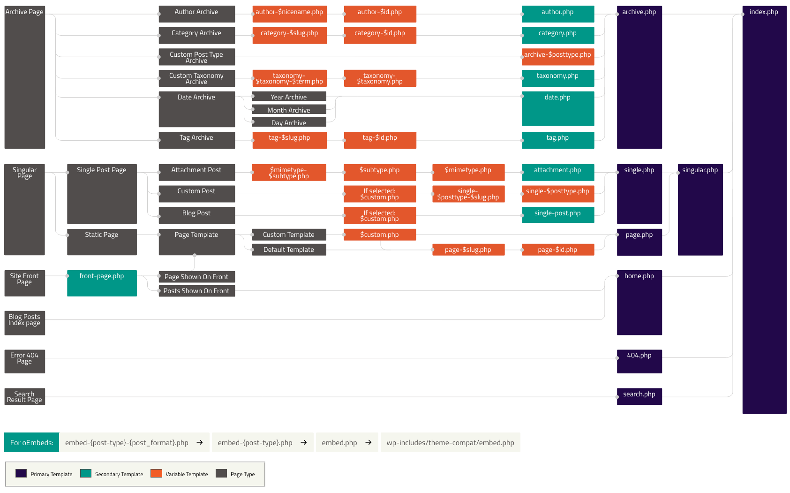

# Veebirakenduste loomine Wordpressi platvormil

Laura Hein, Martti Raavel

---

## Kolmas kohtumine

- Wordpressi halduspaneel
- Mallid
- Kuidas WP otsustab, millist malli kasutada?
- Plokid ja plokimustrid
- Teemad

---

## Wordpressi halduspaneeli kasutajaliides

---

## Mallid

Wordpressi mallid on failid, mis määravad, kuidas teie veebisaidi sisu veebilehitsejas kuvatakse. Mallid on WordPressi teemade lahutamatu osa ja võimaldavad luua erineva kujundusega postitusi, lehekülgi ja muid sisutüüpe.

Kui loote ise omale Wordpressi lehekülge, siis on väga oluline mõista, kuidas mallid töötavad, et saaksite oma veebisaidi kujundust ja funktsionaalsust kohandada vastavalt oma vajadustele.

Näiteks määravad mallid seda, kuidas teie postitused ja leheküljed välja näevad, millised elemendid neil on, ja kuidas need on paigutatud. Mallid võivad sisaldada erinevaid elemente, nagu päis, jalus, külgriba, sisu ala jne.

---

## Kuidas WP otsustab, millist malli kasutada?

WordPressi mallihierarhia määrab, millist mallifaili WordPress kasutab, kui keegi külastab teie veebisaidi lehte. Mallihierarhia on reeglistik, mis ütleb WordPressile, millist mallifaili laadida, lähtudes päringu tüübist ja sellest, kas mall on teemas olemas. Näiteks kui keegi külastab ühte postitust, otsib WordPress kõigepealt faili single-{post-type}.php, seejärel single.php ja lõpuks index.php (või vastavaid .html faile plokiteemade puhul).

---

## WP Mallihierarhia

---

## Plokid ja plokimustrid

WordPressi plokid on sisuelemendid, mida saab kasutada postituste ja lehekülgede loomisel. Plokid võimaldavad teil luua erinevaid sisu paigutusi ja kujundusi, ilma et peaksite koodi kirjutama.

Plokimustrid on eelnevalt kujundatud plokkide kogumid, mida saab kasutada kogu veebisaidi kujundamiseks. Plokimustrid võimaldavad teil luua keerukaid paigutusi ja kujundusi, kasutades ainult plokke, mis on WordPressi sisseehitatud sisuelemendid. Plokimustrid on suurepärased neile, kes soovivad luua kohandatud veebisaidi ilma koodi kirjutamata.

---

## Plokkide näited:

- Lõik
- Pilt
- Pealkiri
- Galerii
- Nimekiri
- Tsitaat
- Accordion
- Arhiivid
- Heli
- ...

---

## Plokimustrite näited:

- Starter content
- Bännerid
- Call to action
- Esiletõstetud
- Galerii
- Jalused
- Päised
- ...

---

## Teemad

WordPressi teemad on mallide komplekt, mis muudab veebisaidi kujundust, sealhulgas sageli seda, kuidas mingid elemendid veebilehel asetsevad. Teema muutmine muudab seda, kuidas veebisait välja näeb, st millisena näeb seda veebisadid külastaja. WordPress.org-i teemakataloogis on tuhandeid tasuta WordPressi teemasid, kuigi paljud WordPressi saidid kasutavad kohandatud teemasid.

---

## Klassikalised teemad vs plokipõhised teemad

WordPressi teemad jagunevad kahte kategooriasse: klassikalised teemad ja plokipõhised teemad.

- Klassikalised teemad on traditsioonilised WordPressi teemad, mis kasutavad PHP-d ja HTML-i veebisaidi kujundamiseks.
- Plokipõhised teemad, mida nimetatakse ka plokiteemadeks, on uusim teematüüp, mis kasutab ainult HTML-i ja CSS-i, ilma PHP-ta.

Plokipõhised teemad on loodud spetsiaalselt selleks, et kasutada ära WordPressi plokkide võimsust ja paindlikkust. Plokipõhised teemad võimaldavad teil luua kohandatud paigutusi ja kujundusi, kasutades ainult plokke, mis on WordPressi sisseehitatud sisuelemendid.

---

## Plokipõhised teemad

Selle koolituse käigus kasutame ja loome plokipõhiseid teemasid, kuna need on suurepärased neile, kes soovivad luua kohandatud veebisaidi ilma koodi kirjutamata. Plokipõhised teemad võimaldavad teil keskenduda veebisaidi kujundusele ja funktsionaalsusele, kasutades ainult plokke, mis on WordPressi sisseehitatud sisuelemendid.

---
