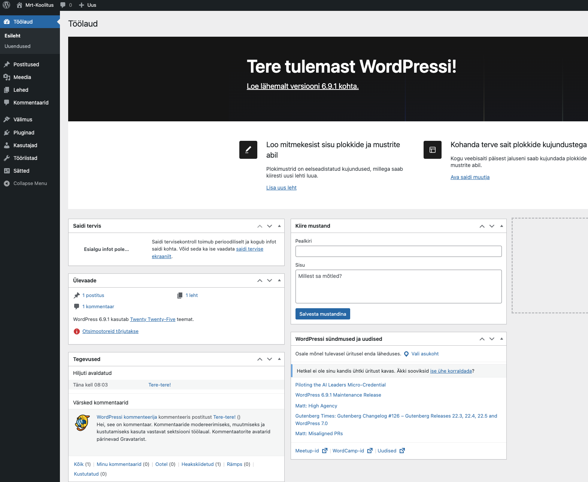

# Veebirakenduste loomine Wordpressi platvormil

Laura Hein, Martti Raavel

---

## Teine kohtumine

- Veendume, et kõigil on võimalus Wordpressi kasutada
- Wordpressi halduspaneel
- Postitus vs Lehekülg
- Mallid
- Kuidas WP otsustab, millist malli kasutada?
- Plokid ja plokimustrid
- Teemad

---

---

## Wordpressi halduspaneeli kasutajaliides

---

# Postitus vs Lehekülg

Vaikimis on Wordpressis kahte erinevat tüüpi sisu: **postitused** ja **leheküljed**.

Postitused on ajas muutuvad, leheküljed on aga staatilised. Postitusi kasutatakse näiteks blogi pidamiseks, lehekülgi aga näiteks kontaktinfo, teenuste ja toodete tutvustamiseks.

---

## Postitus (Post)

1. **Ajalisus**: Postitused on ajastatud ja kuvatakse tavaliselt kronoloogilises järjekorras, kusjuures uusimad postitused ilmuvad esilehel või postituste lehel kõige ees.

2. **Kategooriad ja Sildid**: Postitusi saab liigitada kategooriate ja siltide järgi, mis aitavad organiseerida ja kategoriseerida blogi sisu.

3. **Kommentaarid**: Tavaliselt on postitustel võimalus lugejatel kommenteerida.

4. **Arhiiv**: WordPress loob automaatselt arhiivid postituste jaoks, mis põhinevad kuupäevadel, kategooriatel ja siltidel.

5. **Dünaamiline**: Postitusi kasutatakse sageli ajakohase sisu jaoks, näiteks blogipostitused, uudised, pressiteated jne.

---

## Lehekülg (Page)

1. **Staatiline sisu**: Leheküljed on mõeldud staatilise sisu jaoks, mis ei muutu sageli. Näiteid on "Kontakt", "Meist", "KKK" jne.

2. **Hierarhia**: Lehekülgedel on hierarhiline struktuur, mis tähendab, et saate luua alamlehti. Näiteks võib "Teenused" lehekülje all olla alamlehti nagu "Konsultatsioon", "Disain" jne.

3. **Ei kuulu kategooriatesse ega siltidesse**: Erinevalt postitustest ei liigitata lehekülgi kategooriate ega siltide alla.

4. **Kommentaarid**: Vaikimisi ei ole lehekülgedel kommentaaride osa, kuigi seda saab sõltuvalt teemast ja vajadusest lubada.

5. **Ei ole ajastatud**: Lehekülgedel puudub avaldamiskuupäev või aeg, ehkki need on loomulikult dateeritud sisemiselt.

---

## Postitus vs Leht

| Omadus                | Postitus (Post) | Leht (Page)    |
| --------------------- | --------------- | -------------- |
| Ajalisus              | Jah             | Ei             |
| Kategooriad ja Sildid | Jah             | Ei             |
| Kommentaarid          | Jah (vaikimisi) | Ei (vaikimisi) |
| Arhiiv                | Jah             | Ei             |
| RSS-voog              | Jah             | Ei             |
| Hierarhia             | Ei              | Jah            |

---

## Mallid

Wordpressi mallid on failid, mis määravad, kuidas teie veebisaidi sisu veebilehitsejas kuvatakse. Mallid on WordPressi teemade lahutamatu osa ja võimaldavad luua erineva kujundusega postitusi, lehekülgi ja muid sisutüüpe.

Kui loote ise omale Wordpressi lehekülge, siis on väga oluline mõista, kuidas mallid töötavad, et saaksite oma veebisaidi kujundust ja funktsionaalsust kohandada vastavalt oma vajadustele.

Näiteks määravad mallid seda, kuidas teie postitused ja leheküljed välja näevad, millised elemendid neil on, ja kuidas need on paigutatud. Mallid võivad sisaldada erinevaid elemente, nagu päis, jalus, külgriba, sisu ala jne.

---

## Kuidas WP otsustab, millist malli kasutada?

WordPressi mallihierarhia määrab, millist mallifaili WordPress kasutab, kui keegi külastab teie veebisaidi lehte. Mallihierarhia on reeglistik, mis ütleb WordPressile, millist mallifaili laadida, lähtudes päringu tüübist ja sellest, kas mall on teemas olemas. Näiteks kui keegi külastab ühte postitust, otsib WordPress kõigepealt faili single-{post-type}.php, seejärel single.php ja lõpuks index.php (või vastavaid .html faile plokiteemade puhul).

---

## WP Mallihierarhia

---

## Plokid ja plokimustrid

WordPressi plokid on sisuelemendid, mida saab kasutada postituste ja lehekülgede loomisel. Plokid võimaldavad teil luua erinevaid sisu paigutusi ja kujundusi, ilma et peaksite koodi kirjutama.

Plokimustrid on eelnevalt kujundatud plokkide kogumid, mida saab kasutada kogu veebisaidi kujundamiseks. Plokimustrid võimaldavad teil luua keerukaid paigutusi ja kujundusi, kasutades ainult plokke, mis on WordPressi sisseehitatud sisuelemendid. Plokimustrid on suurepärased neile, kes soovivad luua kohandatud veebisaidi ilma koodi kirjutamata.

---

## Plokkide näited:

- Lõik
- Pilt
- Pealkiri
- Galerii
- Nimekiri
- Tsitaat
- Accordion
- Arhiivid
- Heli
- ...

---

## Plokimustrite näited:

- Starter content
- Bännerid
- Call to action
- Esiletõstetud
- Galerii
- Jalused
- Päised
- ...

---

## Teemad

WordPressi teemad on mallide komplekt, mis muudab veebisaidi kujundust, sealhulgas sageli seda, kuidas mingid elemendid veebilehel asetsevad. Teema muutmine muudab seda, kuidas veebisait välja näeb, st millisena näeb seda veebisadid külastaja. WordPress.org-i teemakataloogis on tuhandeid tasuta WordPressi teemasid, kuigi paljud WordPressi saidid kasutavad kohandatud teemasid.

---

## Klassikalised teemad vs plokipõhised teemad

WordPressi teemad jagunevad kahte kategooriasse: klassikalised teemad ja plokipõhised teemad.

- Klassikalised teemad on traditsioonilised WordPressi teemad, mis kasutavad PHP-d ja HTML-i veebisaidi kujundamiseks.
- Plokipõhised teemad, mida nimetatakse ka plokiteemadeks, on uusim teematüüp, mis kasutab ainult HTML-i ja CSS-i, ilma PHP-ta.

Plokipõhised teemad on loodud spetsiaalselt selleks, et kasutada ära WordPressi plokkide võimsust ja paindlikkust. Plokipõhised teemad võimaldavad teil luua kohandatud paigutusi ja kujundusi, kasutades ainult plokke, mis on WordPressi sisseehitatud sisuelemendid.

---
