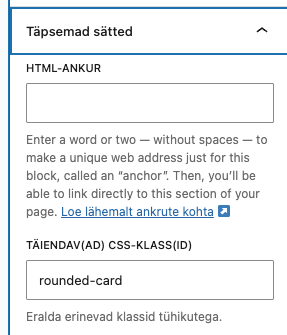

# Veebirakenduste loomine Wordpressi platvormil

Laura Hein, Martti Raavel

---

## Viies kohtumine

- Praktilised hatjutused
- Iseseisev töö oma veebilehega
- Saidi stiilid
  - Tüpograafia
  - Värvid
  - Taust
  - Varjud
  - Paigutus
- CSS-i lisamine Wordpressi lehele
- Veel mallidest

---

## Esilehe mall

Eraldi mall, mis on mõeldud kasutamiseks ainult esilehel.

---

## CSS-i lisamine Wordpressi lehele

Kõigepealt tuleb wordpressile täpselt öelda, millisele komponendile soovid CSS-i rakendada. Selleks saab lisada erinevatele komponentidele juurde lisaklassid. Seda saad teha komponendi redigeerimisel, vahekaardi Täpsemalt alt -> Täiendavad CSS-klassid.

Seejärel saad lisada CSS-i, mis rakendub ainult sellele komponendile, kasutades selle klassi nime.

Välimus → Redaktor → Stiilid → Additional CSS

---

## Näiteks komponendile ümarate nurkade tegemiseks:

```css
.rounded-corners {
  border-radius: 10px;
}
```

Ja siis lisame selle klassi komponendile, millele soovime ümarad nurgad teha.



---
