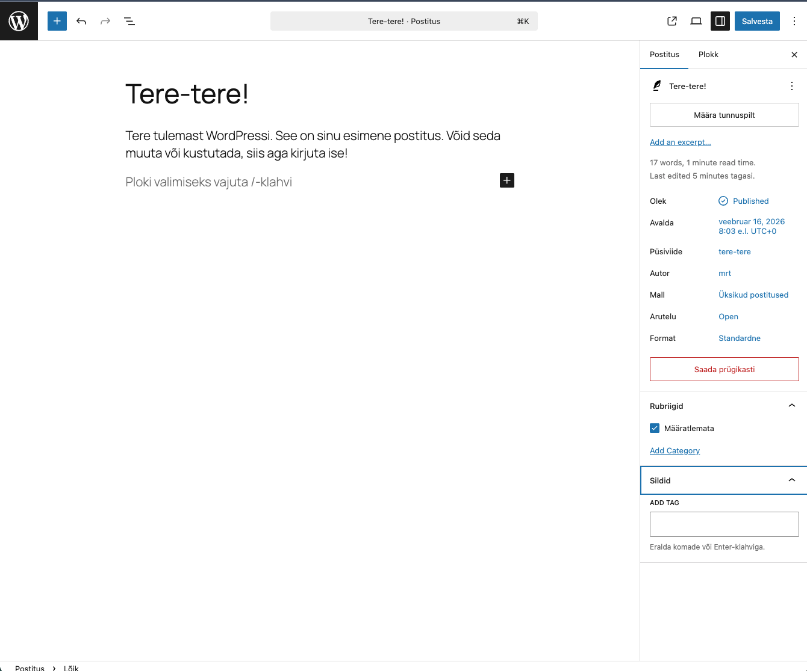
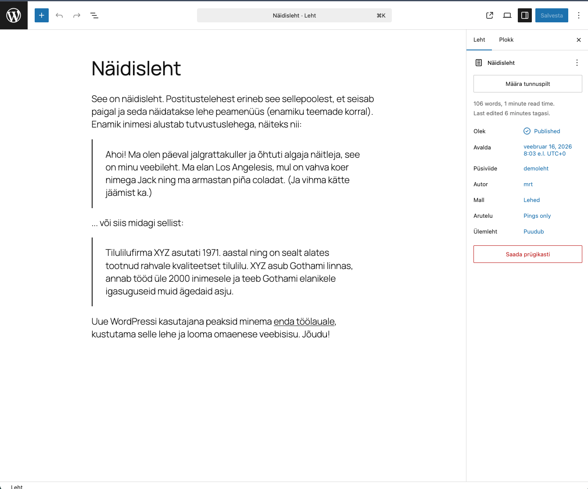

# Postitus ja leht

Vaikimis on Wordpressis kahte erinevat tüüpi sisu: postitused ja lehed. Postitused on ajas muutuvad, lehed on aga staatilised. Postitusi kasutatakse näiteks blogi pidamiseks, lehti aga näiteks kontaktinfo, teenuste ja toodete tutvustamiseks. Postitusel ja leheküljel on sarnasused ja erinevused, mida käsitleme allpool.

## Postitus (Post)

1. **Ajalisus**: Postitused on ajastatud ja kuvatakse tavaliselt kronoloogilises järjekorras, kusjuures uusimad postitused ilmuvad esilehel või postituste lehel kõige ees.

2. **Kategooriad ja Sildid**: Postitusi saab liigitada kategooriate ja siltide järgi, mis aitavad organiseerida ja kategoriseerida blogi sisu.

3. **Kommentaarid**: Tavaliselt on postitustel võimalus lugejatel kommenteerida.

4. **Arhiiv**: WordPress loob automaatselt arhiivid postituste jaoks, mis põhinevad kuupäevadel, kategooriatel ja siltidel.

5. **Rss-voog**: Postitused on tavaliselt kaasatud saidi RSS-voogu, mis võimaldab lugejatel tellida teie sisu ja jälgida seda RSS-lugejates.

6. **Dünaamiline**: Postitusi kasutatakse sageli ajakohase sisu jaoks, näiteks blogipostitused, uudised, pressiteated jne.

## Leht (Page)

1. **Staatiline sisu**: Lehed on mõeldud staatilise sisu jaoks, mis ei muutu sageli. Näiteid on "Kontakt", "Meist", "KKK" jne.

2. **Hierarhia**: Lehtedel on hierarhiline struktuur, mis tähendab, et saate luua alamlehti. Näiteks võib "Teenused" lehe all olla alamlehti nagu "Konsultatsioon", "Disain" jne.

3. **Ei kuulu kategooriatesse ega siltidesse**: Erinevalt postitustest ei liigitata lehti kategooriate ega siltide alla.

4. **Kommentaarid**: Vaikimisi ei ole lehtedel kommentaaride osa, kuigi seda saab sõltuvalt teemast ja vajadusest lubada.

5. **Ei ole ajastatud**: Lehtedel puudub avaldamiskuupäev või aeg, ehkki need on loomulikult dateeritud sisemiselt.

6. **Ei kajastu RSS-voogudes**: Lehed ei ilmu teie WordPressi saidi RSS-voogu.

## Võrdlus

| Omadus                | Postitus (Post) | Leht (Page)    |
| --------------------- | --------------- | -------------- |
| Ajalisus              | Jah             | Ei             |
| Kategooriad ja Sildid | Jah             | Ei             |
| Kommentaarid          | Jah (vaikimisi) | Ei (vaikimisi) |
| Arhiiv                | Jah             | Ei             |
| RSS-voog              | Jah             | Ei             |
| Hierarhia             | Ei              | Jah            |

## Kokkuvõtteks

- **Postitused** on dünaamiline sisu, mis on ajastatud ja mõeldud regulaarseks ajakohastamiseks ja interaktsiooniks lugejatega.
- **Lehed** on staatilised ja mõeldud püsivamaks sisuks, mis ei muutu kuigi sageli.
- Lehed võivad sisaldada postitusi, kuid postitused ei saa sisaldada lehti. Valik postituste ja lehtede vahel sõltub teie saidi struktuurist ja sisuvajadustest.
