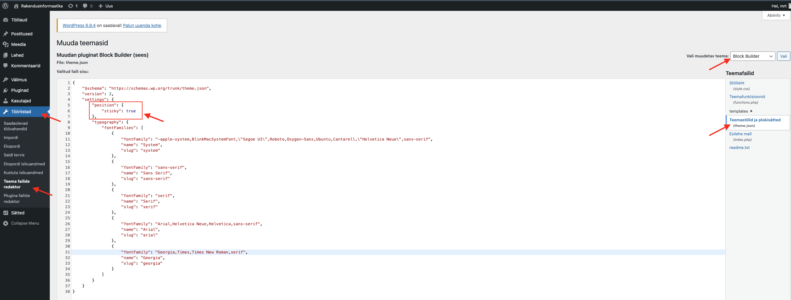
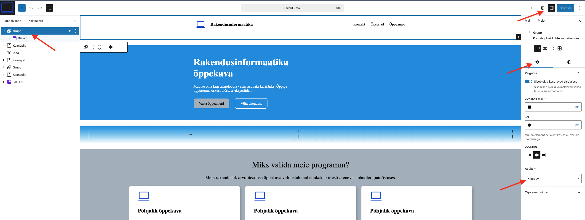

# Sticky position

Kui oled näinud, et veebilehtedel jääb menüü või mõni muu element ekraanil fikseeritult, isegi kui kerid lehte alla, siis on tõenäoline, et sellel elemendil on CSS-i omadus `position: sticky;`. See omadus võimaldab elemendil "kinni jääda" teatud positsioonile, kui kasutaja lehte kerib.

Näiteks, kui soovid, et lehekülje päis oleks alati nähtav, isegi kui kasutaja kerib alla, tuleb päise elemendile lisada `sticky` omadus. Siinjuures tuleb tähelepanu pöörata mõnele asjaolule, mis on Wordpressi spetsiifiline.

- Sticky omadust saab lisada ainult `Group` tüüpi plokile. Kui Sul on loodud päise malliosa või muster, siis see tuleb lisada kõigepealt `Group` plokki ja alles seejärel sellele `sticky` omadus.
- Igal teemal ei pruugi olla `sticky` omadus vaikimisi lubatud. Selleks, et see oleks võimalik, tuleb täiendada teema `theme.json` faili, lisades sinna `settings` alla `sticky` omaduse. Näiteks:

```json
{
  "sticky": {
    "enabled": true
  }
}
```

Seda faili saad muuta Wordpressi administraatori paneelist, valides menüüst Tööriistad -> Teema failide redaktor. Veendu, et paremal üleval on valitud teema, kus soovid faili muuta, ja seejärel otsi üles `theme.json` fail. Enne muudatuste tegemist tee kindlasti varukoopia oma teemast, et vajadusel saaksid taastada algse olukorra.



Pööra tähelepanu sellele, et see on ainult üks osa `json` failist ja see tuleb lisada õigesse kohta, et kogu fail oleks kehtiv. Siin on näide Block Builder teema `theme.json` failist, kus on lubatud `sticky` omadus (võid näiteks selle kopeerida oma originaalse `theme.json` faili sisu asemel, kui kasutad Block Builder teemat):

> [!IMPORTANT]
>
> Kui originaalses `theme.json` failis on teistsugune sisu, siis vaata siit failist lihtsalt, kuidas `sticky` omadus on lisatud ja lisa see oma faili samamoodi, et kogu fail oleks kehtiv.

> [!IMPORTANT]
>
> Muuda seda faili ainult siis, kui tõesti on vajadus, sest vale muudatus võib teema töös probleeme tekitada. Enne muudatuste tegemist tee kindlasti varukoopia oma teemast, et vajadusel saaksid taastada algse olukorra.

```json
{
  "$schema": "https://schemas.wp.org/trunk/theme.json",
  "version": 2,
  "settings": {
    "position": {
      "sticky": true
    },
    "typography": {
      "fontFamilies": [
        {
          "fontFamily": "-apple-system,BlinkMacSystemFont,\"Segoe UI\",Roboto,Oxygen-Sans,Ubuntu,Cantarell,\"Helvetica Neue\",sans-serif",
          "name": "System",
          "slug": "system"
        },
        {
          "fontFamily": "sans-serif",
          "name": "Sans Serif",
          "slug": "sans-serif"
        },
        {
          "fontFamily": "serif",
          "name": "Serif",
          "slug": "serif"
        },
        {
          "fontFamily": "Arial,Helvetica Neue,Helvetica,sans-serif",
          "name": "Arial",
          "slug": "arial"
        },
        {
          "fontFamily": "Georgia,Times,Times New Roman,serif",
          "name": "Georgia",
          "slug": "georgia"
        }
      ]
    }
  }
}
```

Kui oled `sticky` omaduse lisanud, saad selle määrata `Group` plokile `Grupp` ploki omaduste alt, alajaotuses `Asukoht` -> `Kleepuv`.



Kui oled selle omaduse lisanud, siis see element jääb ekraanil fikseeritult, kui kasutaja kerib lehte alla. Lisaks võiks olla grupile määratud ka taustavärv, kuna muidu tekib olukord, kus keritav lehekülg on nähtav läbi päise.
